# QBMS v2.0 - Flowcharts & Diagrams

This document contains visual representations of the QBMS v2.0 system architecture, user flows, and data relationships using Mermaid diagrams.

---

## 1. System Architecture Overview

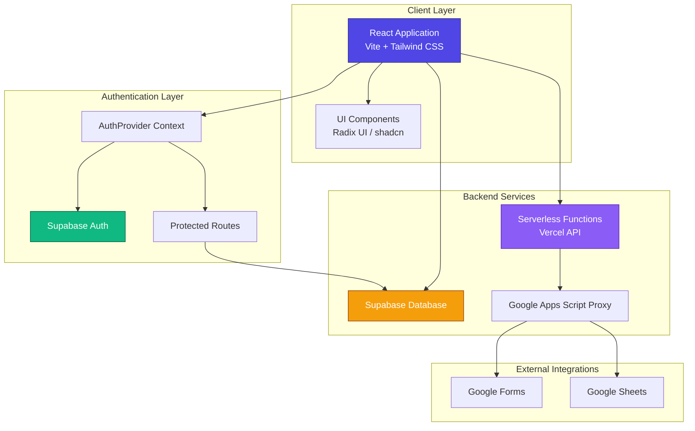

---

## 2. User Authentication Flow

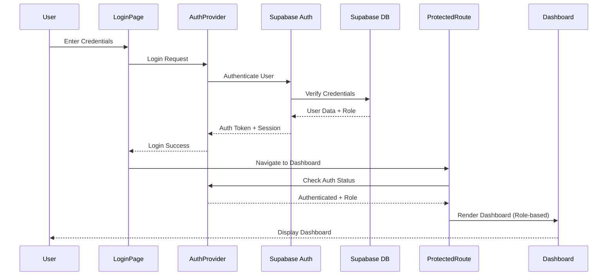

---

## 3. Application Routing Structure

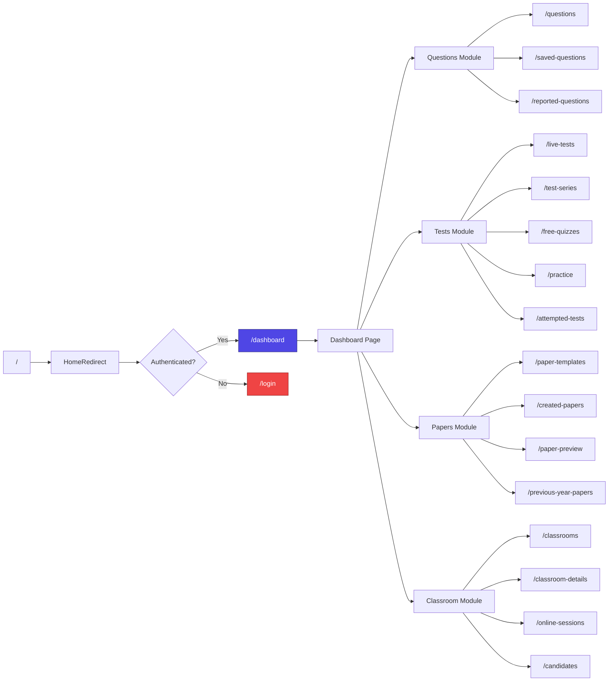

---

## 4. Database Schema (Entity Relationship)

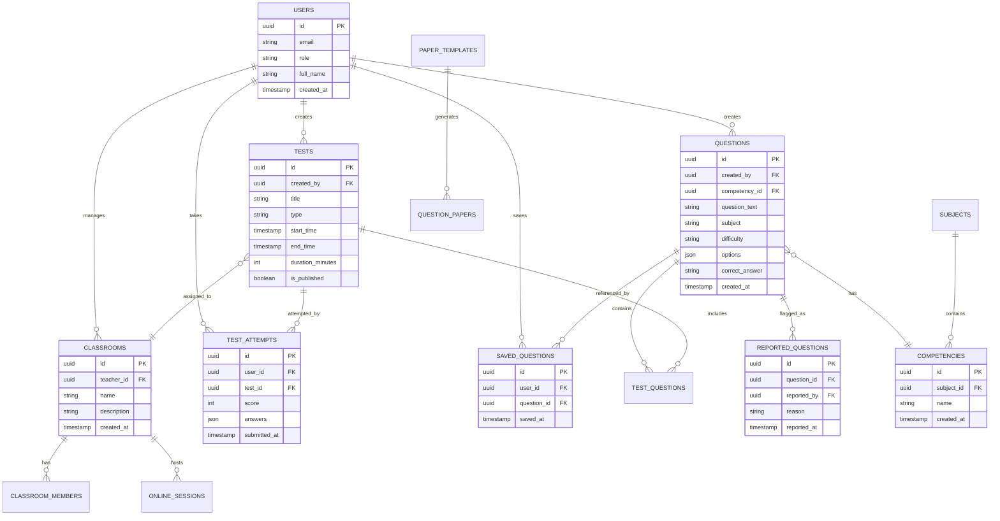

---

## 5. Question Management Workflow

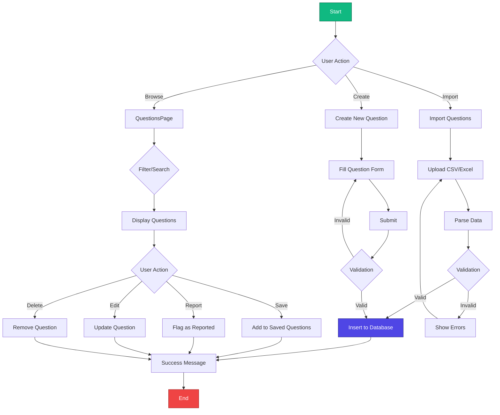

---

## 6. Test Creation & Execution Flow

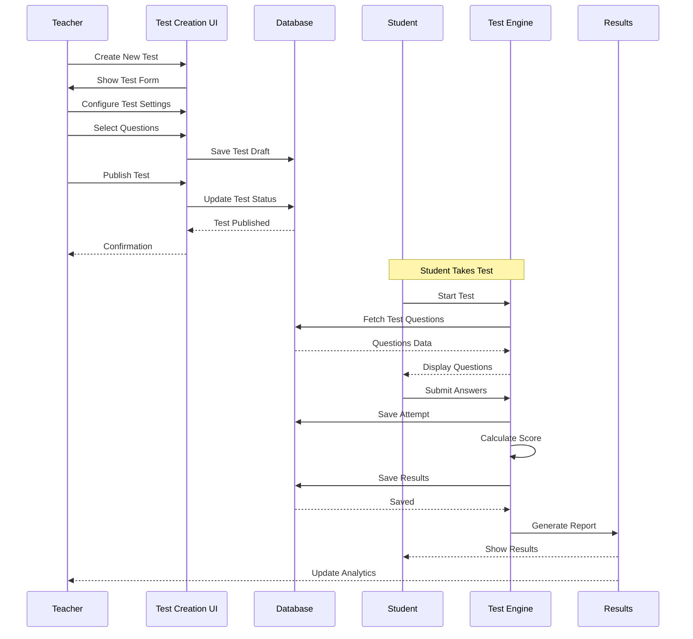

---

## 7. Paper Generation Process

```mermaid
flowchart LR
    A[Start] --> B[Select Paper Template]
    B --> C{Template Type}
    
    C -->|Existing| D[Load Template]
    C -->|New| E[Create Template]
    
    E --> F[Define Structure]
    F --> G[Set Sections]
    G --> H[Configure Marks]
    
    D --> I[Configure Parameters]
    H --> I
    
    I --> J[Select Question Pool]
    J --> K{Selection Method}
    
    K -->|Manual| L[Pick Questions]
    K -->|Auto| M[AI-based Selection]
    
    L --> N[Preview Paper]
    M --> N
    
    N --> O{Approve?}
    O -->|No| P[Modify]
    P --> I
    O -->|Yes| Q[Generate PDF]
    
    Q --> R[Save to Database]
    R --> S[Download/Print]
    S --> T[End]
    
    style A fill:#10b981,stroke:#065f46,color:#fff
    style T fill:#ef4444,stroke:#991b1b,color:#fff
    style Q fill:#f59e0b,stroke:#92400e,color:#fff
```

---

## 8. Classroom & Online Session Management

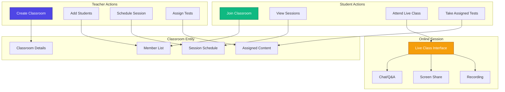

---

## 9. Google Forms Integration Flow

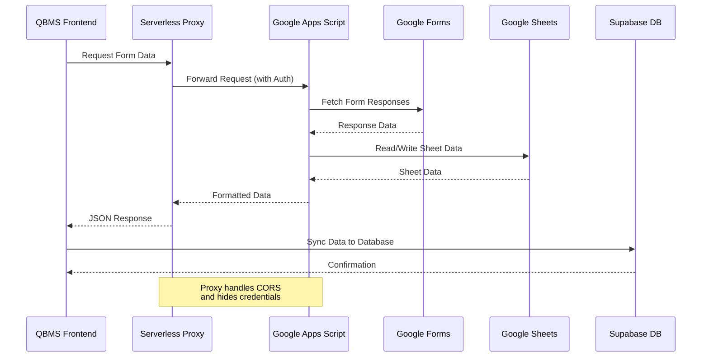

---

## 10. Role-Based Access Control (RBAC)

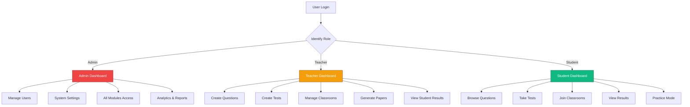

---

## 11. Component Hierarchy

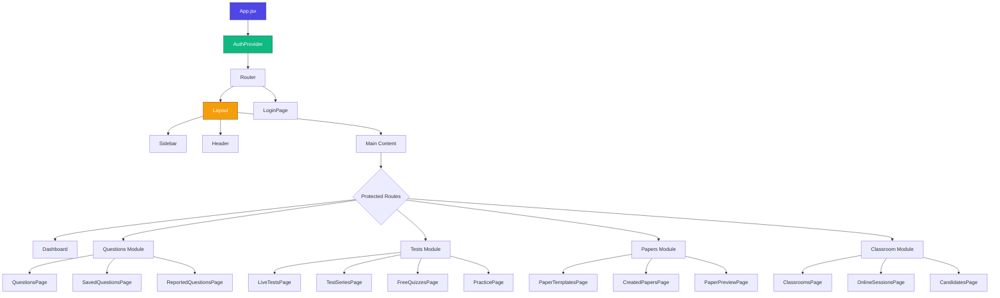

---

## 12. Data Flow: Question to Test to Result

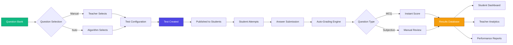

---

## 13. State Management Architecture

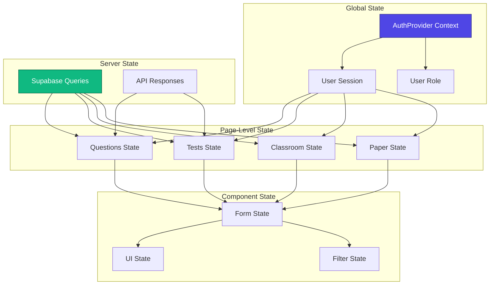

---

## 14. Build & Deployment Pipeline

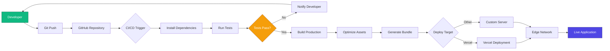

---

## 15. Error Handling & Logging Flow

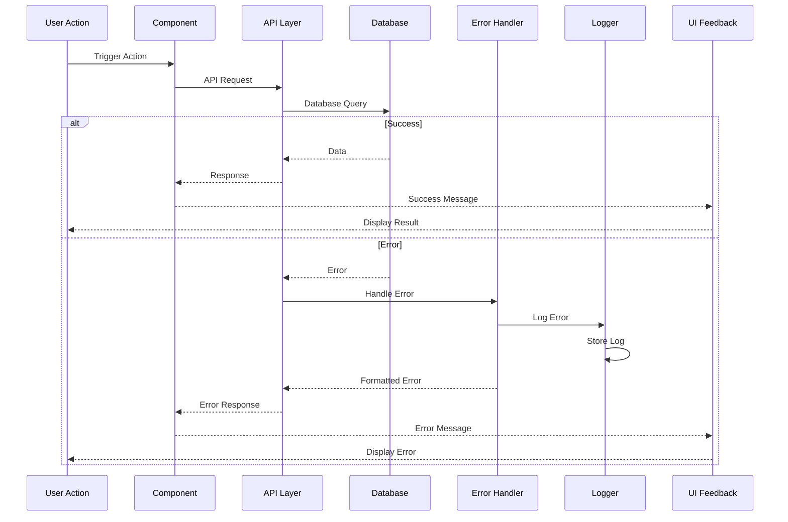

---

## Legend

### Color Coding
- 🟦 **Blue (#4f46e5)**: Core Application Components
- 🟩 **Green (#10b981)**: Authentication & Success States
- 🟧 **Orange (#f59e0b)**: Data & Processing
- 🟪 **Purple (#8b5cf6)**: External Services
- 🟥 **Red (#ef4444)**: Error States & Admin Functions

### Diagram Types Used
- **Flowchart**: Process flows and decision trees
- **Sequence Diagram**: Interaction between components over time
- **Entity Relationship**: Database schema and relationships
- **Graph**: System architecture and hierarchies

---

## Usage Notes

All diagrams in this document are created using **Mermaid** syntax and can be:
- Rendered in GitHub, GitLab, and most modern markdown viewers
- Exported as SVG/PNG using Mermaid CLI or online editors
- Embedded in documentation websites
- Modified easily by editing the code blocks

To edit these diagrams, use the [Mermaid Live Editor](https://mermaid.live/) or any compatible markdown editor.
